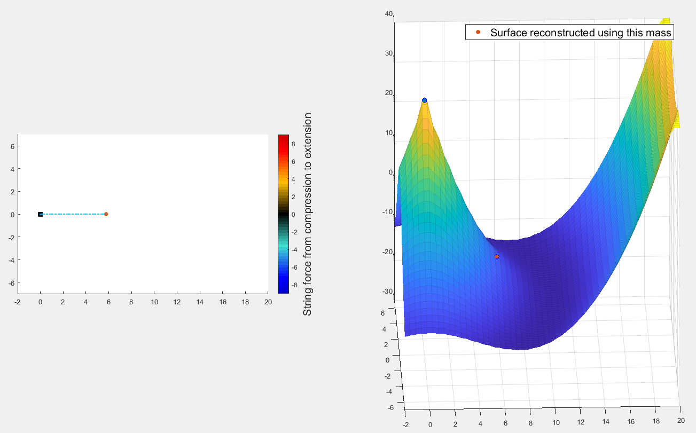
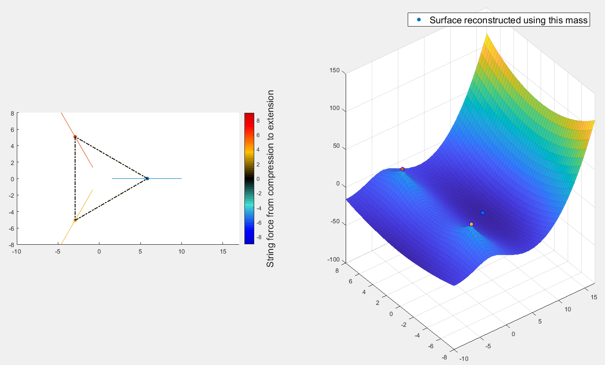
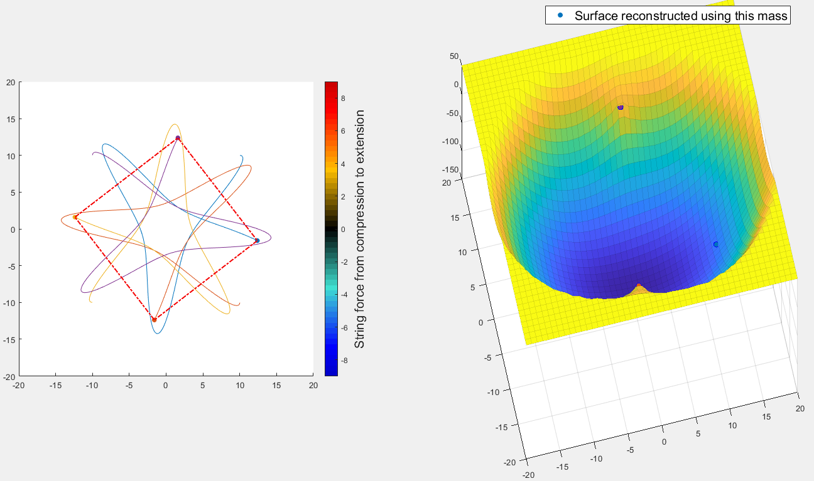
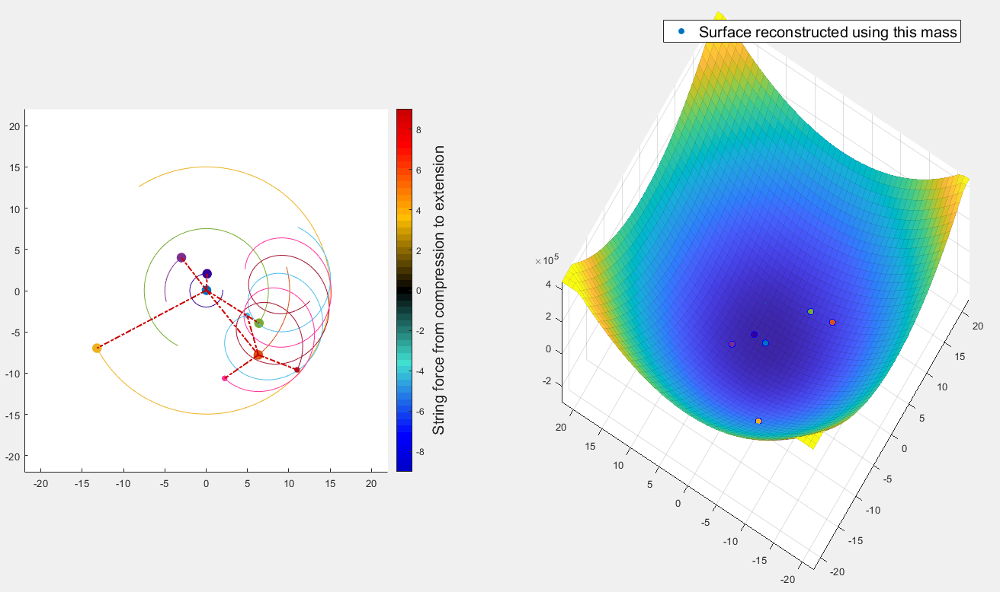

<link href="style.css" rel="stylesheet"></link>

#### <p style='text-align: right;'> 330 Computer Simulation - Project 1 Report<br/> Ziyi Zhang - zz2463<br/> March 13, 2020 </p>

***

### 1. Introduction
This project aims to visualize the potential energy field of a planar spring-mass system with a 3D surface, and use this surface to help understand certain behaviors of the dynamic system. The 2D visualization part is also rewritten to demonstrate the force exerted on any spring in realtime. 

***

### 2. Equations and Numerical Methods
#### 2.1 Simulation
#### 2.1.1 Theoretical Equations
Define the position and velocity as
$$
\begin{cases}
x_i,~y_i,~z_i\qquad \text{The position of mass i} \\
u_i,~v_i,~w_i\qquad \text{The velocity of mass i}
\end{cases}
$$
For mass $i$, the force analysis can be summarised as
$$
\begin{cases}
    m_i\Large\frac{du_i}{dt} &= \sum\limits_{j=1}^N \sigma_{ij}S_{ij} (R_{ij}-R_{ij}^0) \Large\frac{x_j-x_i}{R_{ij}} \\
    m_i\Large\frac{dv_i}{dt} &= \sum\limits_{j=1}^N \sigma_{ij}S_{ij} (R_{ij}-R_{ij}^0) \Large\frac{y_j-y_i}{R_{ij}} \\
    m_i\Large\frac{dw_i}{dt} &= \sum\limits_{j=1}^N \sigma_{ij}S_{ij} (R_{ij}-R_{ij}^0) \Large\frac{z_j-z_i}{R_{ij}} \\
\end{cases}
$$
where $N$ is the number of masses, $\sigma_{ij}$ is a matrix indicating whether $i$th mass and $j$th mass are connected, $S_{ij}$ is the spring constant and $R_{ij}^0$ is the spring natural length.
#### 2.1.2 Numerical Methods
Notice $\large{\frac{dx_i}{dt}}=u_i$, $\large{\frac{dy_i}{dt}}=v_i$, $\large{\frac{dz_i}{dt}}=w_i$, we can conclude that
$$
\frac{V_i(t+\Delta t)-V_i(t)}{\Delta t} = \sum\limits_{j=1}^N \sigma_{ij}S_{ij} (R_{ij}-R_{ij}^0) \Large\frac{x_j-x_i}{R_{ij}}
$$
The program uses vector operations to accelerate here. 
#### 2.2 3D Visualization
We need to choose a focusing mass to visualize the potential energy field that particular mass feels. Notice different choice of focusing masses will lead to completely different surfaces.  
The visualization of the potential enerygy field is achieved by moving the focusing mass to a set of pre-calculated locations in the plane. The resultant force at each point is then calculated. The next step is to reconstruct a surface based on those forces. Technically this is an reverse-gradient operation. Finally we interpolate the surface to visualize it in 3D. Many other details need to be taken care of to achieve stable result and they will not be elaborated here.  
#### 2.2.1 Reverse-gradient
Let $Z$ be the surface, $Z_0$ be the sampe results that represent gradients, the goal is to minimize the cost function
$$
||\text{gradient}(Z)-Z_0||_2
$$
This problem has been well researched. After trying several methods, an implementation$^{[1]}$ turns out to have the best performace and is adopted.

***

### 3. Visualization Interpretation
Take a simple harmonic motion as example. Left hand side is 2D visualization where a free mass is connected with an anchor point; right hand side is the reconstructed surface as seen by the orange dot.

#### 3.1 2D Case
- The dot-dash line indicates a spring connecting two masses.
- The color of the spring, referenced by the colorbar to the right, indicates the magnitude of the force exerted on that spring. Warmer color is for compression force, and colder colors are for extension forces.
- The size of dot is proportional to the mass. This example does not illustrate this point.
- (disabled in this setup) the dot will leave a fixed-length trial behind it, with the same color as the dot.
#### 3.2 3D Case
- The legend indicates which point is the program using as the focusing mass.
- The colors of dots correspond to those in 2D case.
- The surface might be truncated and/or smoothed for both visualization and numerical calculation reasons.
- We can interpret it as if the focusing mass is rolling in this 3D surface due to gravity. But strictly speaking that is not accurate. 
- We can see that the valley the orange mass is rolling is fixed because the blue mass is an anchor point. That symmetric valley explains everything about simple harmonic motion: why the motion is symmetric, why it is periodic, why the middle point has the fastest speed, etc.

***

### 4. Tests
To make sure the program is correctly coded, I designed a tribody senario where three masses are placed at the vertices of a regular triangle, with zero initial velocity.  
The simulation went as we speculated. It is a periodic motion, and each mass is doing simple harmonic motion in its own direction.  
I tried to change simulation step $\Delta t$ in different scales and the result is quite stable. **This step has been repeated for all coming test cases.**  
The 3D surface is reconstructed focusing on the blue dot. It is very reasonable throughout the movie.


***

### 5. Results
#### 5.1 Square
We place four masses at the vertices of a regular square, with some initial velocity. The simulation creates some beautiful pattern.


#### 5.2 Stable
One of my goal is to create a stable system using springs. This is much easier than a stable system in space because we can control which two masses are connected by springs.  
This is the most complicated system among all those I created that works. We have a central mass (light blue) conneced with five masses, each with different location and velocity. One of them has its own three smaller masses surrounding.
This system can be stable for a long time, but due to structural design failure, it will eventually collapse. There is no simple fix to this structure.  
It is interesting that, if we look at the 3D surface reconstructed by the central mass, we will notice that the surface is changing shape dramatically, but that point always stays at the bottom of the valley. That is the reason why this system is stable. Of course, mathematical calculation shows it still moves a little bit, and the movement will accumulate. 


#### 5.3 Self-stable
I also want to design a system where it tends to balance itself, which means a tiny disturbance from outside will be be magnified, but instead attenuated. A real life example can be found
[here](https://idsc.ethz.ch/research-dandrea/research-projects/archive/balancing-cube.html).
I assume we need some energy input to achieve this, but I never succeeded. 

***

### 6. Refrence
- (1) Matthew Harker, Paul O'Leary, (2020). Surface Reconstruction from Gradient Fields: grad2Surf Version 1.0 (https://www.mathworks.com/matlabcentral/fileexchange/43149-surface-reconstruction-from-gradient-fields-grad2surf-version-1-0), MATLAB Central File Exchange. Retrieved March 13, 2020.
- (2) Víctor Martínez-Cagigal (2020). Whitish Jet Colormap (https://www.mathworks.com/matlabcentral/fileexchange/67415-whitish-jet-colormap), MATLAB Central File Exchange. Retrieved March 14, 2020.

***

### Appendix A How to run the code
You can run the code in realtime, with any setup. No need to wait for a long time to create a movie. This is achieved by splitting the project into two parts:
- part A: SpringSimulation.m that does all simulation and stores the data into a mat file. It can be configured to disable all visual output for speed consideration.
- part B: GravityField.m that reads the mat file and calculate 2D and 3D visualization. It supports 'fast forward'.

To be more specific, to run 'stable' setup:
```{MATLAB}
>> RunSpringStable  % a script of variables for 'stable'
>> filename = 'stable'; SaveData
>> GravityField('stable')  % start the movie
```

Replacing three appearances of 'stable' by 'harmonic', 'tribody' or 'square' will run the corresponding script.  
You can also create your own 'RunSpringXXX' script with arbitary setup to play around with the system. 

***

### Appendix B SpringSimulation.m
```{MATLAB}
%% spring system simulation
% The main script to run simulation
% Use 'GravityField' to visualize the gravity field after running this
% simulation

%{
% visualization parameters
c = [0, 0, 1;
     0.4, 0.8, 0.5;
     0.8, 0, 0.5;
     0.9, 0.4, 0];
dequeSize = 150;
XHist = ones(N, dequeSize) .* L(1, :)';
YHist = ones(N, dequeSize) .* L(2, :)';
dequePtr = 1; % deque to show trace
%{

%}
axisXMin = -1.5 * max(L, [], 'all');
axisXMax =  1.5 * max(L, [], 'all');
axisYMin = -1.5 * max(L, [], 'all');
axisYMax =  1.5 * max(L, [], 'all');
fieldResolution = 50;
axisXSpace = (axisXMax - axisXMin) / (fieldResolution-1);
axisYSpace = (axisYMax - axisYMin) / (fieldResolution-1);
[surfX, surfY] = meshgrid(axisXMin:axisXSpace:axisXMax, axisYMax:-axisYSpace:axisYMin);
% graphics output
set(gcf, 'double', 'on')
subplot(1, 2, 1)
hold on
h = scatter(L(1, :), L(2, :), 25.*ones(1, N), c(1:N, :), 'filled');
for i = 1:N
    htrail(i) = plot(XHist(i, :), YHist(i, :), 'Color', c(i, :));
end
hold off
subplot(1, 2, 2)
hold on
hfield = surf(surfX, surfY, zeros(length(surfX), length(surfY)), 'FaceColor', 'flat', 'EdgeAlpha', 0.1);
for i = 1:N
    hfieldmass(i) = scatter3(L(1, i), L(2, i), 0, 40, c(i, :), 'filled', 'MarkerEdgeColor', 'b');
end
hold off
view(3)
%}
%
%% Check validity of input
A = logical(A);
assert(nnz(V(:, A)) == 0);  % anchor points must have velocity zero
assert(size(Spring, 2) == 4);
assert(nnz(M<=0) == 0);
for i = 1:size(Spring, 1)
    assert(~( A(Spring(i, 1)) && A(Spring(i, 2)) ));  % should not have string connecting two anchor points
end

%% visualization
% spring color
cSpringConst = 55;
cSpring = whitejet(cSpringConst);
if visRealtime
    
    % marker color
    cMarker = colorcube;
    s = RandStream('mt19937ar','Seed',0);
    RandStream.setGlobalStream(s);
    idx = randperm(size(cMarker, 1));
    cMarker = cMarker(idx, :);
    cMarker = [lines(7); cMarker];
    % size
    mSize = calcSize(M);
    % trail deque
    Xtrail = ones(N, dequeSize) .* L(1, :)';
    Ytrail = ones(N, dequeSize) .* L(2, :)';
    dequePtr = 1; % deque to show trace
    % figrue
    figure('Position', [1739 50 1600 900])
    hold on
    set(gcf, 'double', 'on');
    % plot anchor and normal points
    for i = 1:N
        if A(i)
            h(i) = scatter(L(1, i), L(2, i), mSize(i)+10, 's', 'MarkerFaceColor', cMarker(i, :),...
                        'MarkerEdgeColor', 'black', 'LineWidth', 2);
        else
            h(i) = scatter(L(1, i), L(2, i), mSize(i), 'o', 'MarkerFaceColor', cMarker(i, :), 'MarkerEdgeColor', 'none');
            htrail(i) = plot(Xtrail(i, :), Ytrail(i, :), 'Color', cMarker(i, :));
        end
    end
    % plot springs
    for i = 1:size(Spring, 1)
        hspr(i) = plot(L(1, [Spring(i, 1), Spring(i, 2)]), L(2, [Spring(i, 1), Spring(i, 2)]),...
                      '-.', 'Marker', 'none', 'LineWidth', 1.5);
    end
    axis equal
    hold off
    % color bar
    %{
    colormap(cSpring);
    caxis([-9 9]);
    cbar = colorbar;
    cbar.Label.String = 'String force from compression to extension';
    %}
    % axis lim
    halfLength = max([max(L(1, :))-min(L(1, :)), max(L(2, :))-min(L(2, :))]);
    if halfLength<5, halfLength=5;end
    axisXMin = -halfLength*1.5;
    axisXMax = halfLength*1.5;
    axisYMin = -halfLength*1.5;
    axisYMax = halfLength*1.5;
end

if storeData
    
    XHist = zeros(N, clockmax);
    YHist = zeros(N, clockmax);
    colorSprIdx = zeros(size(Spring, 1), clockmax);
end

%% simulation starts here
count = 1;
for clock = 1:clockmax

    t = clock * dt;
    F = calcF(L, Spring);
    % now updating the velocity of i-th object
    for i = 1:N

        if A(i), continue;end  % skip anchor
        a = zeros(2, 1);
        for j = 1:N
            if i==j, continue;end  % divide by 0
            a = a + F(i, j) .* (L(:, j)-L(:, i)) ./ norm(L(:, i)-L(:, j));
        end
        a = a ./ M(i);

        % update velocity
        V(:, i) = V(:, i) + a .* dt;
    end
    % updating the location of i-th object
    L = L + V .* dt;

    % update realtime figrue
    if visRealtime
        for i = 1:N
            if A(i), continue;end
            set(h(i), 'xdata', L(1, i), 'ydata', L(2, i));
        end

        Xtrail(:, dequePtr) = L(1, :)';
        Ytrail(:, dequePtr) = L(2, :)';
        dequePtr = dequePtr + 1;
        if (dequePtr > dequeSize), dequePtr = 1;end
        for i = 1:N
            if A(i), continue;end
            set(htrail(i), 'xdata', [Xtrail(i, dequePtr:dequeSize), Xtrail(i, 1:dequePtr-1)],...
                           'ydata', [Ytrail(i, dequePtr:dequeSize), Ytrail(i, 1:dequePtr-1)]);
        end
    end
    % update spring, update spring color
    for i = 1:size(Spring, 1)
        dev = ceil(abs(3*F(Spring(i, 1), Spring(i, 2))));
        if dev>27, dev=27;end
        if F(Spring(i, 1), Spring(i, 2))>0
            color = cSpring(28+dev, :);
            if storeData, colorSprIdx(i, clock)=28+dev;end
        else
            color = cSpring(28-dev, :);
            if storeData, colorSprIdx(i, clock)=28-dev;end
        end
        if visRealtime
            set(hspr(i), 'xdata', L(1, [Spring(i, 1), Spring(i, 2)]),...
                         'ydata', L(2, [Spring(i, 1), Spring(i, 2)]),...
                         'Color', color);
        end
    end
    if visRealtime
        % drawnow
        drawnow
        xlim([axisXMin, axisXMax]);
        ylim([axisYMin, axisYMax]);
        pause(pauseTime);
    end
    % store data
    if storeData
        XHist(:, clock) = L(1, :)';
        YHist(:, clock) = L(2, :)';
    end
    % replot subimage-2
    %{
    gradient_ = zeros(fieldResolution, fieldResolution, 2);
    XArr = axisXMin:axisXSpace:axisXMax;
    YArr = axisYMax:-axisYSpace:axisYMin;
    for i = 1:length(XArr)
        for j = 1:length(YArr)
            for k = 1:N % for point (i, j) calc k-th planet's force

                p = [XArr(j); YArr(i)]; % position of probe
                r = norm(L(:, k) - p);
                gradient_(i, j, 1) = gradient_(i, j, 1) + 1 * (r - R0_) * (L(1, k) - p(1)) / r;
                gradient_(i, j, 2) = gradient_(i, j, 2) + 1 * (r - R0_) * (L(2, k) - p(2)) / r;
            end
        end
    end
    Z = -g2s(gradient_(:,:,1), gradient_(:,:,2), XArr', YArr');
    ZMax = quantile(Z(:), 0.95);
    Z(Z>ZMax) = ZMax;
    ZMin = quantile(Z(:), 0.05);
    Z(Z<ZMin) = ZMin;
    set(hfield, 'zdata', Z); % update field
    massZ = calcZ(Z, L, XArr, YArr);
    for i = 1:N
        set(hfieldmass(i), 'xdata', L(1, i), 'ydata', L(2, i), 'zdata', massZ(i));
    end
    %}
    if ~visRealtime
        if count > 500
            fprintf('%.2f\n', clock/clockmax);
            count = 0;
        end
        count = count + 1;
    end
end

%%
function [F] = calcF(L, Spring)

    N = size(L, 2);
    F = zeros(N, N);
    for i = 1:size(Spring, 1)
        f = Spring(i, 4) * (norm(L(:, Spring(i, 1))-L(:, Spring(i, 2))) - Spring(i, 3));
        F(Spring(i, 1), Spring(i, 2)) = f;
        F(Spring(i, 2), Spring(i, 1)) = f;
    end
end


function [mSize] = calcSize(M)

    low = 32;
    high = 90;
    minM = min(M);
    mSize = low .* (M ./ minM);
    mSize(mSize > high) = high;
end


function [massZ] = calcZ(Z, L, XArr, YArr)
    
    massZ = zeros(1, size(L, 2));
    for i = 1:size(L, 2)
        xx = 1;
        yy = 1;
        for j = 1:length(XArr)
            if XArr(j)>L(1, i)
               xx = j;
               break;
            end
        end
        for j = 1:length(YArr)
            if YArr(j)<L(2, i)
               yy = j;
               break;
            end
        end
        massZ(i) = Z(yy, xx) + 0.2;
    end
end
```

***

### Appendix C GravityField
```{MATLAB}
function [] = GravityField(filename, focusIdx, fastForward)
% Visualize the gravity field based on the stored data
% 'filename' should be a 'mat' file created by 'SaveData.m'

    if nargin<2
        if strcmp(filename, 'harmonic'), focusIdx=2;fastForward=4;end
        if strcmp(filename, 'tribody'), focusIdx=1;fastForward=4;end
        if strcmp(filename, 'square'), focusIdx=1;fastForward=4;end
        if strcmp(filename, 'stable'), focusIdx=1;fastForward=30;end
    end
    %% read in data
    fprintf('Loading file <%s> with focus point index %d.\n', filename, focusIdx);
    data = load(filename);
    data = data.data;
    M = data.M;
    L = data.L;
    V = data.V;
    A = data.A;
    N = length(M);
    Spring = data.Spring;
    colorSprIdx = data.colorSprIdx;
    tmax = data.tmax;
    clockmax = data.clockmax;
    dt = tmax / clockmax;
    if ~isfield(data, 'XHist') || ~isfield(data, 'YHist')
        warning('Please run simulation before running this script.');
        return;
    end
    XHist = data.XHist;
    YHist = data.YHist;
    % fastForward
    idx = 1:fastForward:clockmax;
    clockmax = length(idx);
    XHist = XHist(:, idx);
    YHist = YHist(:, idx);
    colorSprIdx = colorSprIdx(:, idx);
    
    %% visRealtime
    % marker color
    cMarker = colorcube;
    s = RandStream('mt19937ar','Seed',0);
    RandStream.setGlobalStream(s);
    idx = randperm(size(cMarker, 1));
    cMarker = cMarker(idx, :);
    cMarker = [lines(7); cMarker];
    % spring color
    cSpringConst = 55;
    cSpring = whitejet(cSpringConst);
    % size
    mSize = calcSize(M);
    % trail deque
    dequeSize = 600;
    if strcmp(filename, 'harmonic')
        dequeSize = 1;
    elseif strcmp(filename, 'tribody')
        dequeSize = 200;
    elseif strcmp(filename, 'stable')
        dequeSize = 200;
    end
    Xtrail = ones(N, dequeSize) .* L(1, :)';
    Ytrail = ones(N, dequeSize) .* L(2, :)';
    % figrue
    figure('Position', [1739 50 1600 900])
    set(gcf, 'double', 'on');
    leftPanel = subplot(1, 2, 1);
    hold on
    % plot anchor and normal points
    for i = 1:N
        if A(i)
            h(i) = scatter(leftPanel, L(1, i), L(2, i), mSize(i)+10, 's', 'MarkerFaceColor', cMarker(i, :),...
                        'MarkerEdgeColor', 'black', 'LineWidth', 2);
        else
            h(i) = scatter(leftPanel, L(1, i), L(2, i), mSize(i), 'o', 'MarkerFaceColor', cMarker(i, :), 'MarkerEdgeColor', 'none');
            htrail(i) = plot(leftPanel, Xtrail(i, :), Ytrail(i, :), 'Color', cMarker(i, :));
        end
    end
    % plot springs
    for i = 1:size(Spring, 1)
        hspr(i) = plot(leftPanel, L(1, [Spring(i, 1), Spring(i, 2)]), L(2, [Spring(i, 1), Spring(i, 2)]),...
                      '-.', 'Marker', 'none', 'LineWidth', 1.5);
    end
    axis equal
    hold off
    % color bar
    cmap = colormap(leftPanel, cSpring);
    caxis(leftPanel, [-9 9]);
    caxis(leftPanel, 'manual');
    cbar = colorbar();
    cbar.Label.String = 'String force from compression to extension';
    cbar.Label.FontSize = 15;
    % axis lim
    halfLength = max([max(XHist, [], 'all')-min(XHist, [], 'all'), max(YHist, [], 'all')-min(YHist, [], 'all')]);
    if halfLength<5, halfLength=5;end
    axisXMin = -halfLength*1.1;
    axisXMax = halfLength*1.1;
    axisYMin = -halfLength*1.1;
    axisYMax = halfLength*1.1;
    if strcmp(filename, 'harmonic')
        axisXMin=-2;axisXMax=20;axisYMin=-7;axisYMax=7;
    elseif strcmp(filename, 'tribody')
        axisXMin=-10;axisXMax=17;axisYMin=-8;axisYMax=8;
    elseif strcmp(filename, 'square')
        axisXMin=-20;axisXMax=20;axisYMin=-20;axisYMax=20;
    elseif strcmp(filename, 'stable')
        axisXMin=-22;axisXMax=22;axisYMin=-22;axisYMax=22;
    end
    xlim(leftPanel, [axisXMin, axisXMax]);
    ylim(leftPanel, [axisYMin, axisYMax]);

    %% Gravity Field
    % springFocus to accelerate
    SpringFocus = [];
    SpringFocusConnected = false(N, 1);
    SpringFocusConnected(focusIdx) = true;
    for i = 1:size(Spring, 1)
        if Spring(i, 1)==focusIdx
            SpringFocus = [SpringFocus; Spring(i, 2:4)];  %#ok
            SpringFocusConnected(Spring(i, 2)) = true;
        end
        if Spring(i, 2)==focusIdx
            SpringFocus = [SpringFocus; Spring(i, 1), Spring(i, 3:4)];  %#ok
            SpringFocusConnected(Spring(i, 1)) = true;
        end
    end
    % plot hfieldmass
    fieldResolution = 50;
    axisXSpace = (axisXMax - axisXMin) / (fieldResolution-1);
    axisYSpace = (axisYMax - axisYMin) / (fieldResolution-1);
    [surfX, surfY] = meshgrid(axisXMin:axisXSpace:axisXMax, axisYMax:-axisYSpace:axisYMin);
    rightPanel = subplot(1, 2, 2);
    hold on
    hfield = surf(rightPanel, surfX, surfY, zeros(length(surfX), length(surfY)), 'FaceColor', 'flat', 'EdgeAlpha', 0.1);
    for i = 1:N
        if ~SpringFocusConnected(i), continue;end  % only plot connected masses
        hfieldmass(i) = scatter3(rightPanel, L(1, i), L(2, i), 0, 40, cMarker(i, :), 'filled', 'MarkerEdgeColor', 'b');
    end
    % legend
    fakeTarget = scatter3(rightPanel, 0, 0, -200, 2, cMarker(focusIdx, :), 'filled');
    legend_ = legend(fakeTarget, 'Surface reconstructed using this mass');
    legend_.FontSize = 15;
    legend_.AutoUpdate = false;
    % done
    grid on
    hold off
    view(3)
    force = zeros(fieldResolution, fieldResolution, 2);
    XArr = axisXMin:axisXSpace:axisXMax;
    YArr = axisYMax:-axisYSpace:axisYMin;
    xlim(rightPanel, [axisXMin, axisXMax]);
    ylim(rightPanel, [axisYMin, axisYMax]);
    zlimMin = -100;
    zlimMax = 100;
    if strcmp(filename, 'harmonic')
        zlimMin = -30;zlimMax = 40;
    elseif strcmp(filename, 'tribody')
        zlimMin = -100;zlimMax = 150;
    elseif strcmp(filename, 'square')
        zlimMin = -150;zlimMax = 50;
    elseif strcmp(filename, 'stable')
        zlimMin = -3e5;zlimMax = 4.5e5;
    end
    zlim(rightPanel, [zlimMin, zlimMax]);
    massZCorrection = 0.01 * (zlimMax - zlimMin);

    % pauseTime/FPS control
    pauseTime = 0.0;

    %% Start Animation
    for t = 1:clockmax
        pause(pauseTime);
        %% Left Panel
        % update points
        for i = 1:N
            if A(i), continue;end
            set(h(i), 'xdata', XHist(i, t), 'ydata', YHist(i, t));
        end

        for i = 1:N
            if A(i), continue;end
            idxStart = t-dequeSize;
            if idxStart<1, idxStart=1;end
            set(htrail(i), 'xdata', XHist(i, idxStart:t),...
                           'ydata', YHist(i, idxStart:t));
        end
        % update spring, update spring color
        for i = 1:size(Spring, 1)
            set(hspr(i), 'xdata', XHist([Spring(i, 1), Spring(i, 2)], t),...
                         'ydata', YHist([Spring(i, 1), Spring(i, 2)], t),...
                         'Color', cSpring(colorSprIdx(i, t), :));
        end
        %% Right Panel
        force = zeros(fieldResolution, fieldResolution, 2);
        for i = 1:length(YArr)
            for j = 1:length(XArr)
                for k = 1:size(SpringFocus, 1)

                    p = [XArr(j); YArr(i)];  % position of probe
                    k_ = SpringFocus(k, 1);  % idx of connected point
                    Lk_ = [XHist(k_, t); YHist(k_, t)];  % location of k_
                    r = norm([XHist(k_, t); YHist(k_, t)] - p);
                    forceElement = SpringFocus(k, 3) .* (r - SpringFocus(k, 2)) .* (Lk_ - p) ./ r;
                    force(i, j, 1) = force(i, j, 1) + forceElement(1);
                    force(i, j, 2) = force(i, j, 2) + forceElement(2);
                end
            end
        end
        force = toSmooth(force);
        Z = -g2s(force(:,:,1), force(:,:,2), XArr', YArr');

        Z(Z>zlimMax) = zlimMax;
        Z(Z<zlimMin) = zlimMin;
        
        set(hfield, 'zdata', Z); % update field
        massZ = interp2(surfX, surfY, Z, XHist(:, t), YHist(:, t));
        for i = 1:N
            if ~SpringFocusConnected(i), continue;end
            set(hfieldmass(i), 'xdata', XHist(i, t), 'ydata', YHist(i, t), 'zdata', massZ(i)+massZCorrection);
        end
        
        %% update figure
        drawnow
    end
end


%%
function [mSize] = calcSize(M)

    low = 32;
    high = 90;
    minM = min(M);
    mSize = low .* (M ./ minM);
    mSize(mSize > high) = high;
end


function [force] = toSmooth(force)
    
    forceAbs = abs(force);
    forceMax = quantile(forceAbs(:), 0.98);
    force(force>forceMax) = forceMax;
    force(force<-forceMax) = -forceMax;
end


function [massZ] = calcZ(Z, L, XArr, YArr)
    
    massZ = zeros(1, size(L, 2));
    for i = 1:size(L, 2)
        xx = 1;
        yy = 1;
        for j = 1:length(XArr)
            if XArr(j)>L(1, i)
               xx = j;
               break;
            end
        end
        for j = 1:length(YArr)
            if YArr(j)<L(2, i)
               yy = j;
               break;
            end
        end
        massZ(i) = Z(yy, xx) + 0.2;
    end
end
```
