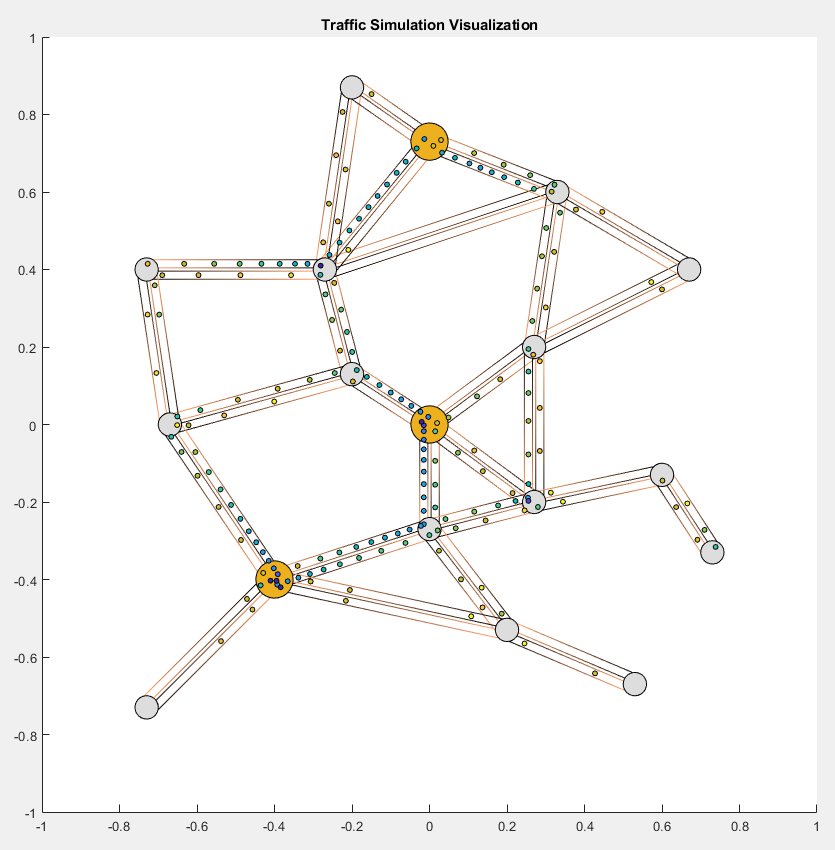
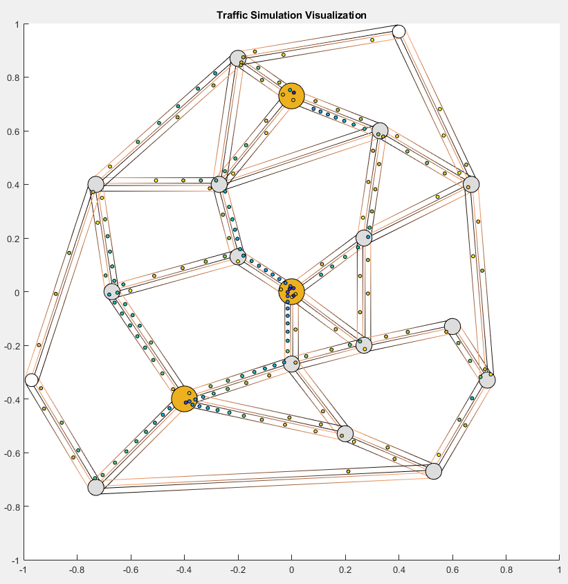

<link href="style.css" rel="stylesheet"></link>

#### <p style='text-align: right;'> 330 Computer Simulation - Project 2 Report<br/> Ziyi Zhang - zz2463<br/> April 27, 2020 </p>

***

### 1. Introduction
This project aims to simulate the traffic of an arbitrary graph and visualize the result with MATLAB. Any directed graph can be used as the input, and the simulation and visualization will be fully automated. Users can also control the details of the roads and nodes.

***

### 2. Equations and Numerical Methods
#### 2.1 Simulation of velocity
#### 2.1.1 Theoretical Equations
The velocity of any vehicle majorly depends on the distance to the car in the front
$$
v~ = ~
\begin{cases}
    0\text{,~~~~~~~~~~~~~~if $d$<$d_{min}$} \\
    v_{max} \text{,~~~~~~~~if $d$>$d_{max}$} \\
    v_{max}\cdot \log{\frac{d}{d_{min}}} / \log{\frac{d_{max}}{d_{min}}} \text{,~~otherwise}\\
\end{cases}
$$
where
- $d$ is the distance to the car in the front (if my car is the first on the current road, the last car on the next road will be used)
- $v_{max}$ is the speed limit. For most of the roads, the value is $80km/h$. For elevated highways, the value is $160km/h$.

There are cases where this equation does not hold, as explained in the next section 2.1.2.
#### 2.1.2 Numerical Methods
Normally, the location of a vehicle is updated based on
$$
\frac{loc(t+\Delta t)-loc(t)}{\Delta t} = \text{Velocity(d)}
$$
where "Velocity" is a function that implements the equation in 2.1.1.  
But there are a few cases where the location is not updated regularly, for example:
- If the car is near its destination and there is no car ahead, it will not accelerate. It should slow down.
- If there is a T-crossing road, straight traffic must go first. This turns out to have a significant influence on the simulation result.
#### 2.2 Path finding
Since the system accepts any directed graph, we need an efficient path-finding algorithm. A naive solution is to use Dijkstra for every car. But in order to accelerate the program, I used the Floyd algorithm to pre-calculate the route between any two nodes and all cars will look up this table when driving.
#### 2.2.1 Dynamic path finding
The problem with any shortest path algorithm is that it does not take congestion into account. All the traffic will flood in one road while another adjacent road is completely empty because it is a little "longer".  
In order to solve this problem, the program will take both traffic amount and road length into consideration to find the fastest (not shortest) path. The Floyd table will be updated every second such that the fastest path is changing in accordance to the real-time road condition.  
There is an example to illustrate this.
#### 2.3 How does the simulation work?
```MATLAB
for clock = 1:clockMax
    % generate cars / set destination to idle cars
    GenerateNewRoutes();
    % update velocity of the cars currently on road
    UpdateVelocity();
    % move cars & delete arrived cars
    MoveCar();
    % update road.queue to get new cars on road
    UpdateRoadQueue();

    % store data and misc.
    ...
end
```
- GenerateNewRoutes: at the beginning of every tick, generate new routes. If there are idle cars, use them first, otherwise create new cars.
- UpdateRoadQueue: New cars will be automatically enqueued and wait. If the road is not full, let go one car from the queue. Notice a car passing by a node will **not** enter the queue. It will not even slow down due to the "straight-traffic-goes-first" principle.
- UpdateVelocity: update the velocity of cars on roads.
- MoveCar: move cars & delete arrived cars. By "deleting an arrived car", I mean put it back in a pool and fetch it later when we generate a new car.

***

### 3. Visualization Interpretation
Take a simple cross-square graph as an example:
- There are four nodes and eight lanes in this map
- **Nodes** are represented as circles. Gray circles stand for small nodes and orange circles stand for mega-nodes. There is really no difference between them. It is only used in visualization to help users see which nodes are more important.
- There are also "pseudo-nodes" not shown here for special reasons. But let's keep this report simple.
- **Paths** are directed. I am using gradual colors to plot them. Cars can only drive from the black end to the orange end. If there is a bi-directional road between two nodes, two paths will be plotted.
- **Cars** are those small dots. The color indicates the speed. The faster a car goes, the warmer the color will be. 
- Sometimes you may notice a lot of dots crowded in one node (upper-left node in the following figure). **This is not a bug**. They are generated by this node but the road is so crowded that they cannot even leave this node. Think it as, this node is a community where some residents want to go to the supermarket, but they found the road has been full of cars and they can't even drive onto the main road! Those drivers soon get impatient and are moving crazily in that node. 


***

### 4. Tests
To make sure the program is correctly coded, I designed a few simple graphs to test the simulation and visualization system.
The simulation went well as we speculated.
I tried to change simulation step $\Delta t$ in different scales and the result is quite stable. **This step has been repeated for all coming test cases.**

Only one example of the tests is shown here. But there are many more, and you can run them on your own PC.
#### 4.1 Intelligent path finding
In the following example, only the upper node is generating cars and the destination is always the lower node. It is generating so many cars that the traffic exceeds the capacity of one road. You will see some cars start to pass by the third node (the one on the left) when the shortest path is too crowded.  
This is hard to illustrate using screenshots. But it is quite obvious in the movie.


***

### 5. Results
Tata... Here comes the highlight of this project. I spent several hours designing a small city with this system! I want to see whether building a circular elevated highway around the city will solve the congestion problem in the city center.
#### 5.1 The city
There are three central nodes (orange) and fifteen small nodes in the city.  
Around three-quarter of the traffic is moving between those three central nodes. But there will also be traffic coming from small nodes or even rural areas (bottom right nodes). Occasionally, people also want to go to rural areas. 

You can see from the map that there is no direct road connecting the central nodes, so the cars will dynamiclly find the fastest path and such paths are changing when time flows.

#### 5.2 Traffic without elevated highways
A screenshot of one moment in the movie.

I recorded the time used by each car to reach its destination, including the time used to wait. The histogram is shown below:

Some cars managed to arrive at the destination in less than 10 seconds (the average distance between two nodes is only 200 meters). In the worst case, it would take two minutes for a car to get to the location.

#### 5.3 Traffic with elevated highways
A screenshot of one moment in the movie. Notice a circular elevated highway is built around the city.

I also recorded the time spent for each car as below:

It is much better!
#### 5.4 Comparison
The result is much better than I expected. Three-quarter of the traffic is going from one of the central node to another central node. I designed this map such that if you want to use the elevated line, it will be **a huge detour**. Yet, it almost halved the maximum waiting time. More importantly, without EL $848$ cars arrived their destination and with EL, in the same amount of time, $964$ cars arrived. The throughput increases by $14\%$.

This is just one interesting application of this system. It accepts any input graph, so there's really a lot can be done.

***

### 6. Reference
None.  
I started this project from scratch. I coded every single line on my own. It took me a lot of time.

***

### Appendix A How to run the code
You can run the code in real time, with any setup. Do not worry about heavy calculation. This is achieved by splitting the project into two parts:
- part A: **TrafficSimulation.m** that does all simulation and stores the data into a mat file. 
- part B: **TrafficVisualization.m** that reads the mat file and generate the movie. It supports "fast forward".

To be more specific, to run the city example above:
```MATLAB
>> runTrafficSimulationCityEL  % a script with the graph info and calls 'TrafficSimulation.m'
>> load('2020-xx-xx-xx-xx.mat')  % Load the data (replace with correct filename)
>> TrafficVisualization(trafficRecord)  % start the movie
```
Alternatively, if you want to skip the simulation, you can also use my pre-calculated result
```MATLAB
>> load('CityWithEL.mat')
>> TrafficVisualization(trafficRecord, 1)
```

- There are a few other scripts with different setups. Feel free to play with them.  
- You can also create your own 'RunTrafficSimulationXXX' script with arbitary graph to play around with the system. 

***

### Appendix B RunTrafficSimulationCityEL.m
```Matlab
% runTrafficSimulationCityEL

o.roadArray = struct(...
    ...% road idx  1   2   3   4   5   6   7   8   9   10   11   12   13   14   15   16   17   18   19   20   21   22   23   24   25   26
    'nodeStart',  {1,  1,  1,  1,  2,  2,  3,  3,  3,  4,   4,   5,   5,   6,   6,   6,   6,   7,   7,   8,   8,   9,   10,  11,  11,  12,...
                   2,  3,  4,  5,  6,  7,  4,  8,  9,  5,   10,  11,  18,  11,  12,  13,  14,  8,   14,  9,   15,  16,  17,  12,  18,  13,...
                   20, 15, 16, 17, 18, 19, 13, 14,...
                   15, 16, 17, 18, 19, 13, 14, 20},...
    'nodeEnd',    {2,  3,  4,  5,  6,  7,  4,  8,  9,  5,   10,  11,  18,  11,  12,  13,  14,  8,   14,  9,   15,  16,  17,  12,  18,  13,...
                   1,  1,  1,  1,  2,  2,  3,  3,  3,  4,   4,   5,   5,   6,   6,   6,   6,   7,   7,   8,   8,   9,   10,  11,  11,  12,...
                   15, 16, 17, 18, 19, 13, 14, 20,...
                   20, 15, 16, 17, 18, 19, 13, 14},...
    'length',     {120,133,167,167,137,243,137,211,167,200, 170, 203, 224, 316, 213, 236, 233, 240, 203, 307, 236, 180, 120, 180, 194, 120,...
                   120,133,167,167,137,243,137,211,167,200, 170, 203, 224, 316, 213, 236, 233, 240, 203, 307, 236, 180, 120, 180, 194, 120,...
                   120,317,97, 184,164,154,177,195,...
                   120,317,97, 184,164,154,177,195},...
    'imageRoad',  {27, 28, 29, 30, 31, 32, 33, 34, 35, 36,  37,  38,  39,  40,  41,  42,  43,  44,  45,  46,  47,  48,  49,  50,  51,  52,...
                   1   2   3   4   5   6   7   8   9   10   11   12   13   14   15   16   17   18   19   20   21   22   23   24   25   26,...
                   61, 62, 63, 64, 65, 66, 67, 68,...
                   53, 54, 55, 56, 57, 58, 59, 60}...
);

o.nodeArray = struct(...
    ...% node idx  1    2    3    4    5    6    7    8    9   10   11   12   13   14   15   16   17   18    :  19    20
    'spawnRate',  {1.6, 0.1, 0.1, 0.1, 0.1, 0.1, 0.1,1.2, 0.1, 0.1, 0.1,1.2, 0.1, 0.1, 0.1, 0.1, 0.1, 0.1,      0,    0},...
    'destChance', {8,   1,   1,   1,   1,   1,   1,   8,   1,   1,   1,   8,   2,   2,   3,   3,   2,   2,      0,    0}...
);

% visArray can be omitted when simulating, but it is necessary for
% visualization
o.visArray = struct(...
    ...% node idx  1    2    3     4    5     6      7      8     9     10    11    12    13    14     15    16     17     18    :  19    20
    'x',          {0.0, -0.2,0,    0.27,0.27, -0.27, -0.67, -0.4, 0.2,  0.6,  0.33, 0,    -0.2, -0.73, -0.73, 0.53, 0.73,  0.67,    0.4,  -0.97},...
    'y',          {0.0, 0.13,-0.27,-0.2,0.2,  0.4,   0,     -0.4, -0.53,-0.13,0.6,  0.73, 0.87, 0.4,   -0.73, -0.67,-0.33, 0.4,     0.97, -0.33}...
);
o.megaNode = [1, 8, 12];

% car speed
o.vmax = 22.2;  % meters/second
o.dmin = 5;  % meters
o.dmax = 100;  % meters
% Simulation speed
o.simulationTime = 200;  % in seconds
o.dt = 0.1;  % in seconds
o.fastForward = 3;

% Run Simulation
TrafficSimulation(o);

```

***

### Appendix C TrafficSimulation.m
```Matlab
% Main simulation file
% Ziyi. April 2020.
function [] = TrafficSimulation(o)

%% Phase input variables
checkInput();
vmax = o.vmax;
dmin = o.dmin;
dmax = o.dmax;
simulationTime = o.simulationTime;
dt = o.dt;
clockMax = ceil(simulationTime / dt);
fastForward = o.fastForward;
roadArray = o.roadArray;
for i = 1:length(roadArray)
    roadArray(i).cost = roadArray(i).length;
end
nodeArray = o.nodeArray;
for i = 1:length(nodeArray)  % Add a new field to 'nodeArray'
    nodeArray(i).straightPriority = [];
end

%% Initialization
% carArray
carArray.velocity = 0;
carArray.roadNum = 0;
carArray.position = 0;
carArray.frontCar = 0;
carArray.backCar = 0;
carArray.alive = 0;
carArray.birthTick = 0;
carArray.roadArray = [];
carArray = repmat(carArray, 1, 10);  % initialize a car pool with ten inactivated cars
% roadArray
for i = 1:length(roadArray)
    roadArray(i).frontCar = 0;
    roadArray(i).backCar = 0;
    roadArray(i).queue = [];
end
path = FloydShortestPath(roadArray, length(nodeArray));
% data recording
trafficRecord = InitTrafficRecord();
carRecord = cell(1, ceil(clockMax/fastForward));
% random number generator
rng(1);

%% Simulation
count = 0;
storeCount = 1;
time = 0;
for clock = 1:clockMax
    % generate cars / set destination to idle cars
    GenerateNewRoutes();
    % update velocity of cars currently on road
    UpdateVelocity();
    % move cars & delete arrived cars
    MoveCar();
    % update road.queue to get new cars on road
    UpdateRoadQueue();

    time = time + dt;
    if (time > 1)  % re-calculate Floyd every five seconds
        time = 0;
        UpdateCost();
    end

    % data recording
    if (mod(clock, fastForward) == 0)
        carRecord{storeCount} = carArray;
        storeCount = storeCount + 1;
    end
    % progress bar
    if count > 400
        fprintf('Simulation Progress %.2f\n', clock/clockMax);
        count = 0;
    end
    count = count + 1;
end
  
disp("Saving data...");
trafficRecord.carRecord = carRecord;
filename = string(datestr(now,'yyyy-mm-dd-HH-MM')) + ".mat";
save(filename, 'trafficRecord');
disp("Result saved to file "+filename);
clear TrafficSimulation

%==========================================================================

%% nested function: do some basic check of whether input variables are valid
function [] = checkInput()
    
    % check imageRoad
    for ii = 1:length(o.roadArray)
        if (o.roadArray(ii).imageRoad > 0)
            j = o.roadArray(ii).imageRoad;
            if (o.roadArray(ii).nodeStart ~= o.roadArray(j).nodeEnd ||...
                o.roadArray(ii).nodeEnd ~= o.roadArray(j).nodeStart ||...
                o.roadArray(ii).length ~= o.roadArray(j).length)
                error("roadArray input invalid: 'imageRoad'.");
            end
        end
    end
    % check nodeArray
    for ii = 1:length(o.nodeArray)
        if (o.nodeArray(ii).spawnRate < 0 || o.nodeArray(ii).spawnRate > 20)
            error("nodeArray input invalid: 'spawnRate'.");
        end
        if (o.nodeArray(ii).destChance < 0)
            error("nodeArray input invalid: 'destChance'.");
        end
    end
    % check roadArray
    for ii = 1:length(o.roadArray)
        if (o.roadArray(ii).length < o.dmin * 2)
            error("roadArray input invalid: 'length' too short compared with 'dmin'.");
        end
    end
end


%% nested function: initialize traffic record object
function [trafficRecord_] = InitTrafficRecord()
    trafficRecord_.vmax = vmax;
    trafficRecord_.dmin = dmin;
    trafficRecord_.dmax = dmax;
    trafficRecord_.simulationTime = simulationTime;
    trafficRecord_.dt = dt;
    trafficRecord_.clockMax = clockMax;
    trafficRecord_.roadArray = roadArray;
    trafficRecord_.nodeArray = nodeArray;
    trafficRecord_.timeToArrive = [];
    if (isfield(o, 'visArray') && length(o.visArray)==length(nodeArray))
        trafficRecord_.visArray = o.visArray;
    end
    if (isfield(o, 'megaNode'))
        trafficRecord_.megaNode = o.megaNode;
    end
end


%% nested function: at the beginning of every tick, generate new routes. If
% there are idle cars, use them first, otherwise create new cars.
function [] = GenerateNewRoutes()
    
    % Generate routes for every node
    for ii = 1:length(nodeArray)
        targetNumCars = nodeArray(ii).spawnRate * dt; % note: this number can be smaller than 1
        % first generate integer part of 'targetNumCars'
        while (targetNumCars >= 1)
            targetNumCars = targetNumCars - 1;
            GenerateOneNewRoute(ii);
        end
        % then generate decimal part of 'targetNumCars'
        randNum = rand(1);
        if (randNum < targetNumCars)
            GenerateOneNewRoute(ii);
        end
    end
    
    
    %% double nested function: Generate one route from 'origin'
    function [] = GenerateOneNewRoute(origin)
        
        persistent destChanceSum
    
        % Calculate 'destChanceSum' if this is the first call of this
        % function
        if isempty(destChanceSum)
            destChanceSum = 0;
            for iii = 1:length(nodeArray)
                destChanceSum = destChanceSum + nodeArray(iii).destChance;
            end
        end
    
        localDestChanceSum = destChanceSum - nodeArray(origin).destChance;
        sum = 0;
        randNumDest = rand(1);
        for iii = 1:length(nodeArray)
            if (iii == origin), continue;end
            if (path(origin, iii) == 0), continue;end  % no route
            sum = sum + nodeArray(iii).destChance;
            if (sum / localDestChanceSum > randNumDest)
                % the iii-th node is chosen to be destination
                carIndex = GetIdleCar();
                carPath = GenerateRoadArray(origin, iii);
                carArray(carIndex).roadNum = carPath(1);
                carArray(carIndex).alive = 2;
                carArray(carIndex).birthTick = clock;
                carArray(carIndex).roadArray = carPath;
                % append to the waiting queue of this road
                roadIdx = carPath(1);
                roadArray(roadIdx).queue(end+1) = carIndex;
                % do not generate another route
                break;
            end
        end
    end


    %% double nested function: Get the index of an idle car. Generate a new
    %  car if there is none.
    function [res] = GetIdleCar()
        for iii = 1:length(carArray)
            if (carArray(iii).alive == 0)
                res = iii;
                return;
            end
        end
        % no idle car left, generate some new cars
        num = length(carArray);
        carArray(num+1:num*2) = carArray(1:num);  % double the size every time
        for iii = num+1:num*2
            carArray(iii).velocity = 0;
            carArray(iii).roadNum = 0;
            carArray(iii).position = 0;
            carArray(iii).frontCar = 0;
            carArray(iii).backCar = 0;
            carArray(iii).alive = 0;
            carArray(iii).birthTick = 0;
            carArray(iii).roadArray = [];
        end

        res = num + 1;
    end
    
    
    %% Generate an array of path (represented by road number) from 'origin' 
    %  node and 'dest' node
    function [res] = GenerateRoadArray(origin, dest)
        if (path(origin, dest) == -1)
            res = GetRoadIndex(origin, dest);
            return;
        else
            res = GenerateRoadArray(origin, path(origin, dest));
            res = [res, GenerateRoadArray(path(origin, dest), dest)];
        end
    end
end


%% nested function: get road index from 'nodeStart' and 'nodeEnd'
function [res] = GetRoadIndex(nodeStart, nodeEnd)
    
    for ii = 1:length(roadArray)
        if (roadArray(ii).nodeStart == nodeStart && roadArray(ii).nodeEnd == nodeEnd)
            res = ii;
            return;
        end
    end
    res = -1;
end


%% nested function: if the road is not full, let go one car from queue
function [] = UpdateRoadQueue()

    for ii = 1:length(roadArray)
        if isempty(roadArray(ii).queue)
            continue;
        end
        queueCarIdx = roadArray(ii).queue(1);
        backCarIdx = roadArray(ii).backCar;
        if (backCarIdx > 0 &&...
            carArray(backCarIdx).position * roadArray(ii).length < dmin)
            % this road is full now
            continue;
        elseif ~isempty(nodeArray(roadArray(ii).nodeStart).straightPriority)
            % straight traffic goes first
            continue;
        else
            % good to go!
            carArray(queueCarIdx).frontCar = backCarIdx;
            carArray(queueCarIdx).alive = 1;
            if (backCarIdx > 0)
                carArray(backCarIdx).backCar = queueCarIdx;
            end
            roadArray(ii).backCar = queueCarIdx;
            if (roadArray(ii).frontCar == 0)
                roadArray(ii).frontCar = queueCarIdx;
            end
            roadArray(ii).queue(1) = [];  % pop from queue
        end
    end
end


%% nested function: update the velocity of cars on roads
function [] = UpdateVelocity()

    % update velocity
    for ii = 1:length(roadArray)
        carIdx = roadArray(ii).backCar;
        while (carIdx > 0)
            frontCarIdx = carArray(carIdx).frontCar;
            if (frontCarIdx == 0)
                % no car ahead (on current road)
                if (length(carArray(carIdx).roadArray) == 1)  % if near destination
                    carArray(carIdx).velocity = Velocity((dmax + dmin)/2);
                else
                    nextRoadIdx = carArray(carIdx).roadArray(2);
                    nextCarIdx = roadArray(nextRoadIdx).backCar;
                    if (nextCarIdx == 0)  
                        % if no car ahead (even taking next road into consideration)
                        carArray(carIdx).velocity = Velocity((dmax + dmin)/2);
                    else
                        % calculate the dist to the car on next road
                        currentRoadIdx = carArray(carIdx).roadArray(1);
                        dist_ = (1 - carArray(carIdx).position) * roadArray(currentRoadIdx).length;
                        dist = dist_ + carArray(nextCarIdx).position * roadArray(nextRoadIdx).length;
                        carArray(carIdx).velocity = Velocity(dist);
                        % add my carIdx to straightPriority if not there
                        if (dist_ < dmin)
                            nodeIdx = roadArray(currentRoadIdx).nodeEnd;
                            if isempty(find(nodeArray(nodeIdx).straightPriority == carIdx, 1))
                                nodeArray(nodeIdx).straightPriority = [nodeArray(nodeIdx).straightPriority, carIdx];
                            end
                        end
                    end
                end
            else
                % car ahead
                dist = roadArray(ii).length * (carArray(frontCarIdx).position - carArray(carIdx).position);
                carArray(carIdx).velocity = Velocity(dist);
            end
            carIdx = frontCarIdx;
        end
    end
    
    
    %% double nested function: Calculate velocity from distance to front car
    function [res] = Velocity(d)

        if(d < dmin)
            res=0;
        elseif(d < dmax)
            res = vmax * log(d/dmin) / log(dmax/dmin);
        else
            res = vmax;
        end
    end
end


%% nested function: move cars & delete arrived cars
function [] = MoveCar()
    
    for ii = 1:length(carArray)
        if (carArray(ii).alive ~= 1), continue;end
        deltaDist = carArray(ii).velocity * dt;
        roadLength = roadArray(carArray(ii).roadNum).length;
        carArray(ii).position = carArray(ii).position + deltaDist / roadLength;

        if (carArray(ii).position > 1)  % end of current road

            carArray(ii).roadArray(1) = [];
            if isempty(carArray(ii).roadArray)  % destination arrived
                currentRoadIdx = carArray(ii).roadNum;
                backCarIdx = carArray(ii).backCar;
                % update car
                DeleteCar(ii);
                % update back car
                if (backCarIdx > 0)
                    carArray(backCarIdx).frontCar = 0;
                end
                % update road
                roadArray(currentRoadIdx).frontCar = backCarIdx;
                if (roadArray(currentRoadIdx).backCar == ii)
                    roadArray(currentRoadIdx).backCar = 0;
                end
            else  % move to next road
                currentRoadIdx = carArray(ii).roadNum;
                nextRoadIdx = carArray(ii).roadArray(1);
                backCarIdx = carArray(ii).backCar;
                frontCarIdx = roadArray(nextRoadIdx).backCar;
                % update this car
                carArray(ii).roadNum = nextRoadIdx;
                carArray(ii).position = (carArray(ii).position - 1) * roadArray(currentRoadIdx).length / roadArray(nextRoadIdx).length;
                carArray(ii).frontCar = frontCarIdx;
                carArray(ii).backCar = 0;
                % update back car
                if (backCarIdx > 0)
                    carArray(backCarIdx).frontCar = 0;
                end
                % update front car
                if (frontCarIdx > 0)
                    carArray(frontCarIdx).backCar = ii;
                end
                % update current road
                roadArray(currentRoadIdx).frontCar = backCarIdx;
                if (roadArray(currentRoadIdx).backCar == ii)
                    roadArray(currentRoadIdx).backCar = 0;
                end
                % update next road
                roadArray(nextRoadIdx).backCar = ii;
                if (roadArray(nextRoadIdx).frontCar == 0)
                    roadArray(nextRoadIdx).frontCar = ii;
                end
                % update node
                nodeIdx = roadArray(currentRoadIdx).nodeEnd;
                idx = find(nodeArray(nodeIdx).straightPriority == ii);
                if ~isempty(idx)
                    nodeArray(nodeIdx).straightPriority(idx) = [];
                end
            end
        end
    end
    
    
    % double nested function: inactivate the car once it arrives at
    % destination
    function [] = DeleteCar(idx)
        
        seconds = dt * (clock-carArray(idx).birthTick);
        trafficRecord.timeToArrive = [trafficRecord.timeToArrive, seconds];
        carArray(idx).velocity = 0;
        carArray(idx).roadNum = 0;
        carArray(idx).position = 0;
        carArray(idx).frontCar = 0;
        carArray(idx).backCar = 0;
        carArray(idx).alive = 0;
        carArray(idx).birthTick = 0;
        carArray(idx).roadArray = [];
    end
end


%% nested function: update the cost of each edge in graph based on rael-time traffic
function [] = UpdateCost()

    cars = carArray(([carArray.alive] == 1) | ([carArray.alive] == 2));
    for ii = 1:length(roadArray)
        numCars = nnz([cars.roadNum] == ii) + 1;
        roadArray(ii).cost = roadArray(ii).length + numCars * dmin * 6;
    end
    % call floyd again
    path = FloydShortestPath(roadArray, length(nodeArray));
end
end

% END of TrafficSimulation.m
```

***

### Appendix D TrafficVisualization.m
```MATLAB
% Main visualization file
% Ziyi. April 2020.
function [] = TrafficVisualization(trafficRecord, fastForward)

%% Phase input variables
if (nargin<2), fastForward=1;end
if (~isfield(trafficRecord, 'visArray'))
    error("TrafficVisualization needs a visArray to plot the figure. It might be missing or invalid.");
end
vmax = trafficRecord.vmax;
dmin = trafficRecord.dmin;
dmax = trafficRecord.dmax;
simulationTime = trafficRecord.simulationTime;
dt = trafficRecord.dt;
clockMax = trafficRecord.clockMax;
roadArray = trafficRecord.roadArray;
roadArray(1).xyStart = [];  % Add two new fields to 'roadArray'
roadArray(1).vec = [];
nodeArray = trafficRecord.nodeArray;
nodeArray(1).xy = [];  % Add one new field to 'nodeArray'
carRecord = trafficRecord.carRecord;
visArray = trafficRecord.visArray;
assert(length(visArray) == length(nodeArray));
megaNode = [];
if isfield(trafficRecord, 'megaNode')
    megaNode = trafficRecord.megaNode;
end

%% Fast forward
carRecord = carRecord(1:fastForward:end);

%% Draw background (road & node)
% everything drawn in [-1, 1]*[-1, 1]
figure
set(gcf, 'Position',  [200, 200, 1000, 1000])
axis manual
axis([-1 1 -1 1]);
pbaspect([1 1 1]);
hold on
title("Traffic Simulation Visualization");

nodeRadius = 0.03;
roadWidth = nodeRadius * 0.7;
% roads
for i = 1:length(roadArray)
    if (roadArray(i).imageRoad == 0)
       % one-way road
       DrawOnewayRoad(i);
    else
       if (roadArray(i).imageRoad < i), continue;end
       % two-way road
       DrawTwowayRoad(i);
    end
end
% nodes
pseudoNode = [19, 20];
for i = 1:length(visArray)
    r = nodeRadius;
    col = '#DDDDDD';
    if ~isempty(find(megaNode == i, 1))
        r = nodeRadius * 1.6;
        col = '#EDB120';
    elseif ~isempty(find(pseudoNode == i, 1))
        r = nodeRadius * 0.8;
        col = 'white';
    end
    coord = [visArray(i).x-r, visArray(i).y-r, 2*r, 2*r];
    rectangle('Position', coord, 'Curvature', [1, 1], 'FaceColor', col, 'EdgeColor', 'black');
end


%% Prepare handles of cars
carSize = 14;
hcar = zeros(1, length(roadArray));
hqueue = zeros(1, length(nodeArray));
for i = 1:length(roadArray)
    hcar(i) = scatter(0, 0, carSize, 'black', 'filled', 'MarkerEdgeColor', 'black');
end
randPosSize = 2000;
randPos = rand(randPosSize, 1);  % a pre-calculated random position array
randPos = [cos(randPos.*2.*pi), sin(randPos.*2.*pi)];
randPos = randPos .* (rand(randPosSize, 1)+0.2) ./ 1.4 .* nodeRadius;
for i = 1:length(nodeArray)
    hqueue(i) = scatter(0, 0, carSize, 'black', 'filled', 'MarkerEdgeColor', 'black');
end

%% Start Animation
pauseTime = 0.00;  % pauseTime/FPS control
if (fastForward>1), pauseTime=0;end  % do not pause if fast forward is set
for clock = 1:length(carRecord)-2
    
    pause(pauseTime);
    carArray = carRecord{clock};
    roadCar = carArray([carArray.alive] == 1);
    queueCar = carArray([carArray.alive] == 2);
    % plot cars on road (alive == 1)
    for i = 1:length(roadArray)
        cars = roadCar([roadCar.roadNum] == i);
        if isempty(cars)
            set(hcar(i), 'xdata', [], 'ydata', []);
            continue;
        end
        loc = repmat(roadArray(i).xyStart, length(cars), 1);
        loc = loc + roadArray(i).vec .* [cars.position]';
        velocity = [cars.velocity];
        % plot
        set(hcar(i), 'xdata', loc(:, 1), 'ydata', loc(:, 2), 'cdata', Velocity2Color(velocity));
    end
    % plot cars in queue (alive == 2)
    roadNum = [queueCar.roadNum];
    if isempty(roadNum)
        nodeNum = [];
    else
        nodeNum = [roadArray(roadNum).nodeStart];
    end
    for i = 1:length(nodeArray)
        num = nnz(nodeNum == i);
        if (num==0)
            set(hqueue(i), 'xdata', [], 'ydata', []);
            continue;
        end
        if (num>50), num=50;end  % dont plot too many dots in the waiting area
        startIdx = randi(randPosSize-1-num);
        loc = randPos(startIdx:startIdx+num-1, :);
        loc = loc + nodeArray(i).xy;
        velocity = zeros(num, 1);
        % plot
        set(hqueue(i), 'xdata', loc(:, 1), 'ydata', loc(:, 2), 'cdata', Velocity2Color(velocity));
    end
    
    % update figure
    drawnow
end
disp("Traffic movie done.");


%% nested function: draw one-way road
function [] = DrawOnewayRoad(idx)

    x0 = visArray(roadArray(idx).nodeStart).x;
    y0 = visArray(roadArray(idx).nodeStart).y;
    x1 = visArray(roadArray(idx).nodeEnd).x;
    y1 = visArray(roadArray(idx).nodeEnd).y;
    dist = norm([x0-x1, y0-y1]);
    orthVec = [y0-y1, x1-x0]/dist;  % unit vector, anti-clockwise 90 degrees + from start to end
    orthVec = orthVec .* roadWidth ./ 2;
    copperColormap = copper(100);
    colormap(copperColormap(1:85, :));
    patch([x0+orthVec(1), x1+orthVec(1)], [y0+orthVec(2), y1+orthVec(2)], [0.1, 0.9], 'FaceColor','none','EdgeColor','interp');
    patch([x0-orthVec(1), x1-orthVec(1)], [y0-orthVec(2), y1-orthVec(2)], [0.1, 0.9], 'FaceColor','none','EdgeColor','interp');
    % set new fields
    roadArray(idx).xyStart = [x0, y0];
    roadArray(idx).vec = [x1-x0, y1-y0];
    nodeArray(roadArray(idx).nodeStart).xy = [x0, y0];
    nodeArray(roadArray(idx).nodeEnd).xy = [x1, y1];
end


%% nested function: draw two-way road
function [] = DrawTwowayRoad(idx)

    x0 = visArray(roadArray(idx).nodeStart).x;
    y0 = visArray(roadArray(idx).nodeStart).y;
    x1 = visArray(roadArray(idx).nodeEnd).x;
    y1 = visArray(roadArray(idx).nodeEnd).y;
    dist = norm([x0-x1, y0-y1]);
    orthVec = [y0-y1, x1-x0]/dist;  % unit vector, anti-clockwise 90 degrees + from start to end
    dispVec = orthVec .* roadWidth .* 0.2;
    orthVec = orthVec .* roadWidth;
    copperColormap = copper(100);
    colormap(copperColormap(1:85, :));
    patch([x0-dispVec(1), x1-dispVec(1)], [y0-dispVec(2), y1-dispVec(2)], [0.1, 0.9], 'FaceColor','none','EdgeColor','interp');
    patch([x0-orthVec(1)-dispVec(1), x1-orthVec(1)-dispVec(1)], [y0-orthVec(2)-dispVec(2), y1-orthVec(2)-dispVec(2)], [0.1, 0.9], 'FaceColor','none','EdgeColor','interp');
    patch([x1+dispVec(1), x0+dispVec(1)], [y1+dispVec(2), y0+dispVec(2)], [0.1, 0.9], 'FaceColor','none','EdgeColor','interp');
    patch([x1+orthVec(1)+dispVec(1), x0+orthVec(1)+dispVec(1)], [y1+orthVec(2)+dispVec(2), y0+orthVec(2)+dispVec(2)], [0.1, 0.9], 'FaceColor','none','EdgeColor','interp');
    % set new fields
    roadArray(idx).xyStart = [x0, y0] - dispVec - 0.5 .* orthVec;
    roadArray(idx).vec = [x1-x0, y1-y0];
    imageIdx = roadArray(idx).imageRoad;
    roadArray(imageIdx).xyStart = [x1, y1] + dispVec + 0.5 .* orthVec;
    roadArray(imageIdx).vec = -[x1-x0, y1-y0];
    nodeArray(roadArray(idx).nodeStart).xy = [x0, y0];
    nodeArray(roadArray(idx).nodeEnd).xy = [x1, y1];
end


%% nested function: return a color based on speed
function [res] = Velocity2Color(speed)

    persistent carColor gap
    
    if isempty(carColor)
        carColor = parula(102);
        gap = vmax / 100;
    end

    res = carColor(floor(speed / gap)+1, :);
end
end

% END of TrafficVisualization.m

```
